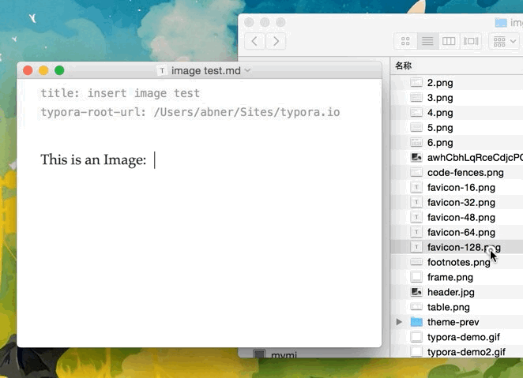

# Использование изображений в Typora

## Изображения в Markdown

In markdown, image is written like ``. The `src` here can either be a url like `https://octodex.github.com/images/yaktocat.png`, or an absolute/relative file path, like `../images/test.png`. 

Дополнительные сведения об изображениях:

[TOC]

## Как вставить изображения в Typora

### Запись в Markdown - Write the Markdown

Вы можете просто записать синтаксис разметки, чтобы вставить изображение. Или нажмите «изображение» из меню или нажмите комбинацию клавиш. Когда вы это сделаете, и между тем, если в буфере обмена есть URL-адрес изображения, то URL-адрес будет непосредственно вставлен в `src`.

### Перетаскивания

Конечно, есть более простой способ - перетащить и сбросить, как и скринкаст ниже.



You could also drag & drop multiple image files at one time.

### Выбрать из локальных файлов

Вы можете щелкнуть пункт меню `Edit` → `Image Tools` → `Insert Local Images…` в строке меню, чтобы открыть диалоговое окно для выбора и вставки локального изображения.

Если вы часто используете этот пункт меню, мы предложим вам повторно назначить комбинацию клавиш для этой команды "insert image", следуя [Custom Key Binding](http://support.typora.io/Custom-Key-Binding/).

### Вставить из буфера

Поскольку файл Markdown является только текстовым файлом, пользователи не могут вставлять данные изображения в файл Markdown напрямую, но могут вставлять ссылку на изображение в file/url.

Typora поддерживает вставку данных изображения из буфера обмена **, после того, как расскажет typora, куда поместить эти изображения **. Typora помещает данные изображения в заданную папку или сервер, а затем вставляет изображения, относящиеся к этому сохраненному файлу или URL-адресу. См. Раздел **[При вставке локального изображения ...](# когда-вставить-локальный-образ ...)** для более подробной информации.

> **Совет**: на macOS пользователи могут копировать файл изображения из finder, а затем вставлять в typora. Он имеет такое же поведение при перетаскивании.
>
> **Совет**: на macOS вы также можете копировать изображения с iPhone, а затем вставлять в Typora после настройки местоположения для размещения файлов изображений.

## При вставке локального изображения

Typora поддерживает копирование файлов изображений в данную папку или веб-сервер (требуется [iPic][]) при вставке локальных изображений с помощью перетаскивания или из строки меню. Ниже приведены инструкции по настройке.

### Поведение по умолчанию

По умолчанию, когда вы вставляете или перетаскиваете файл изображения в Typora, мы будем использовать путь к файлу изображения для атрибута `src`.

### Использовать относительный путь

Если вы включите `Editor` → `Image Insert` →  `Use relative path if possible` в панели настроек, и ваша запись была сохранена в файл, тогда при перетаскивании локального изображения атрибут `src` будет установить как относительный путь к текущему файлу (папке).

### Скопировать файлы изображений в целевую папку при вставке локального изображения

> Чтобы использовать эту функцию, вам нужно выбрать опцию «Разрешить копирование изображений в указанную папку» на панели настроек.

Одним из распространенных сценариев является редактирование сообщений `*.md` в статических сайтах (например, Jekyll) с использованием Typora. Например, если файл `. * Md` помещается в папку `_posts`, в то время как файлы изображений попадают в папку  `_media`, вы можете скопировать файлы изображений в папку `_media`, когда вы перетаскиваете или вставляете изображения в Файл Markdown автоматически. Вот как:

1. Сохраните файл на каком-то пути.

2. Включите «Редактор» → «Вставка изображения» → «Разрешить копирование изображений в указанную папку» на панели настроек.

   

3. Выберите «Редактировать» → «Инструменты изображения» → «При вставке локальных изображений» → «Копировать файл изображения в папку» из меню выберите целевую папку.

   

На шаге 3 новый элемент `typora-copy-images-to: {relative path}` будет вставлен в блок [YAML Front Matter][] текущего документа. Таким образом, вы можете вручную добавить **свойство typora-copy-images-to** в YAML Front Matter, чтобы включить это поведение.

После этого, если вы перетащите **локальные** изображения или вставьте изображения в Typora, файл изображения будет скопирован в целевой файл и обновлен соответствующий `src`.

### Upload image file to web server. (macOS only)

> **Requirements**: macOS ≥ 10.11 and [iPic][] to be installed. Also, you need to enable `Allow upload to given server` in preferences panel.
>
> **Warning**: By default, iPic will upload images to a public web server anonymously, and you won't be able to delete image files from that web server once you upload into it. So please config iPic in advance if you want to enable this feature and control all image files you uploaded.

Here's how to enable this function:

1. Install [iPic][] and **config** a proper online image service.
2. Enable `Editor` → `Image Insert` → `Allow copy images to given folder` in preferences panel.
3. Check item `Edit` → `Image Tools` → `When Insert Local Images` → `Upload Image via iPic` from menubar.

In step 3, a new item `typora-copy-images-to: ipic` will be inserted into the [YAML Front Matter][] block of current document. 

So you could also manually add **typora-copy-images-to: ipic** property in YAML Front Matter to enable this behaviour.

Tips: If you want to move image file to folder `ipic`, you should use `typora-copy-images-to: ./ipic`.

## Display images in relative path

### Relative path to current file/folder (default behavior)

By default, users could refer to local image by relative path to current `*.md` file. For example, if the `*.md` file is at `/User/typora/desktop/test.md`, then the `` will display image from `/User/typora/desktop/image.png` just like the `` tag in HTML. Also, for `../download/image.png`, image from `/User/typora/download/image.png` will be fetched.

### Relative path to certain folder

If you’re using markdown for building websites, you may specify a url prefix for image preview in local computer with property `typora-root-url` in YAML Front Matters. 

For example, input `typora-root-url:/User/Abner/Website/typora.io/` in YAML Front Matters, and then `` will be treated as `` in typora.

In new version, instead of manually input `typora-root-url` property, you could just click item from menubar `Edit` → `Image Tools` → `Use Image Root Path` to tell Typora to generate `typora-root-url` property automatically.

## Upload images to cloud server (macOS only)

### Introduction to iPic


[iPic][] is an app which allows you to upload local images into various cloud service, including  [Imgur](http://imgur.com/), [Flickr](https://www.flickr.com/),[ Amazon S3](https://aws.amazon.com/s3/), etc, and return you a web url of the uploaded image for public access. You could find detailed documents [here](http://toolinbox.net/en/iPic/).

With the integration of [iPic][], users could share markdown file to others without packaging local images along with the plain text file. And users can stop caring about where to put local images or how to refer local images using relative path, since they can simply upload used images into cloud server.

### System requirements and preparation

1. This feature only supports macOS ≥ 10.11.
2. Must install latest version of [iPic][].
3. Configure web server in [iPic][].

### Upload all local images to cloud server

Typora provides a function to upload all local images to cloud server via [iPic][]. To use it, simply, check `Edit` → `Image Tools` → `Upload Local Images via iPic` from menubar and wait for the uploading process to be finished.

### Upload when inserting images

How-tos for this part can be found in section [When insert local image…](#when-insert-local-image…) → Upload image file to web server. (macOS only).

## Align images

Currently Typora does not support image alignment. But you could use HTML code like `<center></center>` to align images on exported HTML or PDF.

Also, by default, if one paragraph only contains one image, it will be center aligned. It is controlled by CSS, and can be reverted by [add custom CSS](http://support.typora.io/Add-Custom-CSS/):

```css
p .md-image:only-child{
    width: auto;
    text-align: inherit;
}
```

## Resize images

Please check [this link](http://support.typora.io/Resize-Image/).


[YAML Front Matter]: http://yaml.org/
[iPic]: https://itunes.apple.com/app/id1101244278?ls=1&amp;amp;mt=12